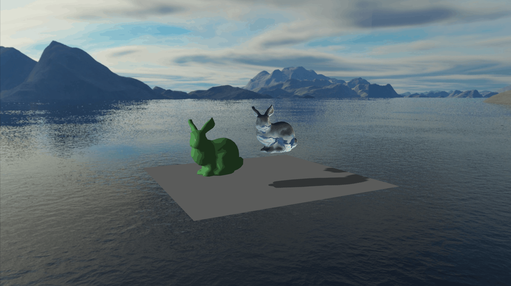

# Interactive Computer Graphics, Assignment 4
## Demo


## Description
This is a 3D scene editor with shadow mapping and environment mapping. You can insert, move, rotate, and rescale 3D models.


## Building and Running
This program has been tested on Ubuntu 20.10

To build the program, run these commands from the root directory:

```
cmake -B build
cmake --build build
```

Then to run the program, run these commands from the root of this repository:

```
cd build
./Assignment4_bin
```

## Examples of output
To see some examples of what this program can do to images, read [this file](assignment_4_report.pdf).
